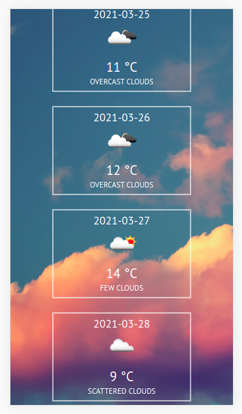
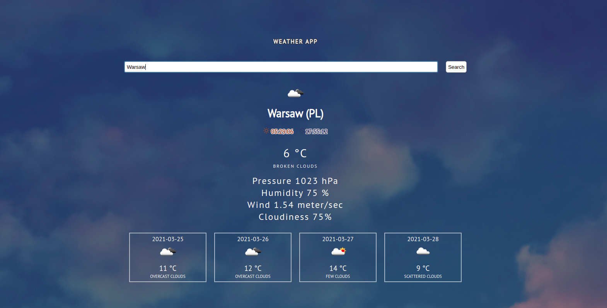

# Weather app

## General Info

This project is simple weather application. It allows you to search for any city and check the current weather and forecast for 4 days.
The application uses OpenWeather API.

This project was bootstrapped with [Create React App](https://github.com/facebook/create-react-app).

### `npm start`

Runs the app in the development mode.\
Open [http://localhost:3000](http://localhost:3000) to view it in the browser.

The page will reload if you make edits.\
You will also see any lint errors in the console.

## Application

